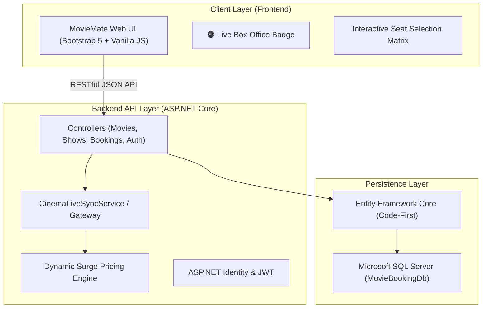

# 🎬 MovieMate - Next-Gen Cinema Ticket Booking Platform

[](https://dotnet.microsoft.com/)
[](https://www.microsoft.com/sql-server/)
[](https://getbootstrap.com/)
[]()

> **MovieMate** is an enterprise-grade full-stack cinema ticket booking web application inspired by BookMyShow and PVR/INOX Vista cinema systems. It features real-time dynamic pricing, live seat occupancy matrix synchronization, multi-tier multiplex layouts, and dedicated administrative controls.

---

## 🌟 Key Features

* **🏙️ Multi-City & Jalgaon Multiplexes**: Real-time cinema locations including **INOX - Khandesh Central Mall** and **P-Square Multiplex** in Jalgaon, alongside Mumbai & Pune multiplexes.
* **🎟️ Interactive Multi-Tier Seat Matrix**: Platinum, Gold, and Silver seat tiers with dynamic visual selection, real-time counter occupancy badges, and seat locking.
* **⚡ Cinema Partner Live Sync Gateway**: Mimics POS gateways (Vista Cinema POS) with a 15-second live polling loop and dynamic surge pricing (Morning discounts, Weekend special, Prime-time surge).
* **🛡️ Admin Dashboard & Catalog Control**:
  * Real-time Revenue & Booking statistics.
  * Add / Delete movies with live catalog updates.
  * Schedule showtimes across screens and dates.
* **🔑 Role-Based Authentication**: Secure ASP.NET Core Identity with JWT bearer tokens for Admins and Customers.
* **📱 Responsive Cinema UI**: Dark-mode streaming aesthetic with instant search suggestions, genre filter tags, and trailer embeds.

---

## 🏗️ System Architecture



---

## 🚀 Quick Start (Running Locally)

### Prerequisites:
* [.NET SDK 8.0 or 10.0](https://dotnet.microsoft.com/download)
* [Microsoft SQL Server Express](https://www.microsoft.com/sql-server/sql-server-downloads)

### 1-Click Launch:
Double-click **`Start_MovieMate.bat`** in the project folder to automatically start the backend server and open the browser!

### Manual CLI:
```powershell
# Navigate to backend API
cd Backend/MovieTicketBooking.API

# Run backend (also hosts the static frontend)
dotnet run --urls "http://localhost:5000"
```
Visit **`http://localhost:5000/`** in your browser!

---

## 🔑 Demo Credentials

| Role | Email | Password |
| :--- | :--- | :--- |
| **Admin** | `admin@movieticket.com` | `Admin@12345` |
| **Customer** | `user@movieticket.com` | `User@12345` |

---

## 📂 Project Structure

```text
MovieTicketBookingSystem/
├── Frontend/                 # Responsive Single-Page Application
│   ├── index.html            # Main home page with featured movies & city selector
│   ├── movies.html           # Full movie catalog with mood & genre filters
│   ├── theatres.html         # Jalgaon & metro cinema multiplex listings
│   ├── seat-selection.html   # Live seat matrix with dynamic surge pricing
│   ├── booking-summary.html  # Ticket cart summary & convenience fee
│   ├── payment.html          # Simulated payment gateway (Card/UPI/NetBanking)
│   ├── ticket.html           # Printable QR-code movie ticket
│   ├── admin/                # Admin Panel (Dashboard, Catalog, Shows, Bookings)
│   ├── css/                  # Custom dark cinema styling
│   └── js/                   # API gateway client & auth session managers
├── Backend/                  # ASP.NET Core Web API
│   └── MovieTicketBooking.API/
│       ├── Controllers/      # REST API endpoints
│       ├── Data/             # ApplicationDbContext & DbSeeder
│       ├── Models/           # Entity models (Movie, Show, Seat, Booking)
│       └── Services/         # CinemaLiveSyncService & Pricing Engine
├── Start_MovieMate.bat       # 1-Click local runner
└── Start_Live_Link.bat       # 1-Click Cloudflare public tunnel launcher
```
